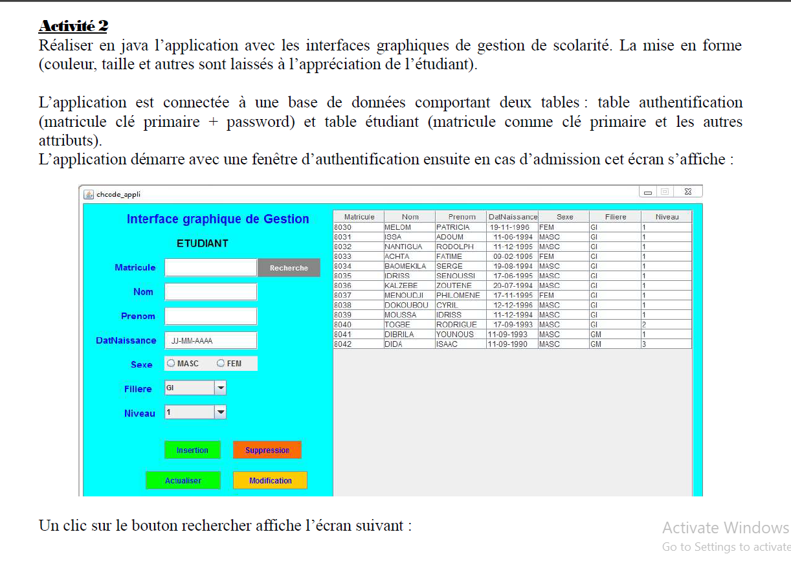
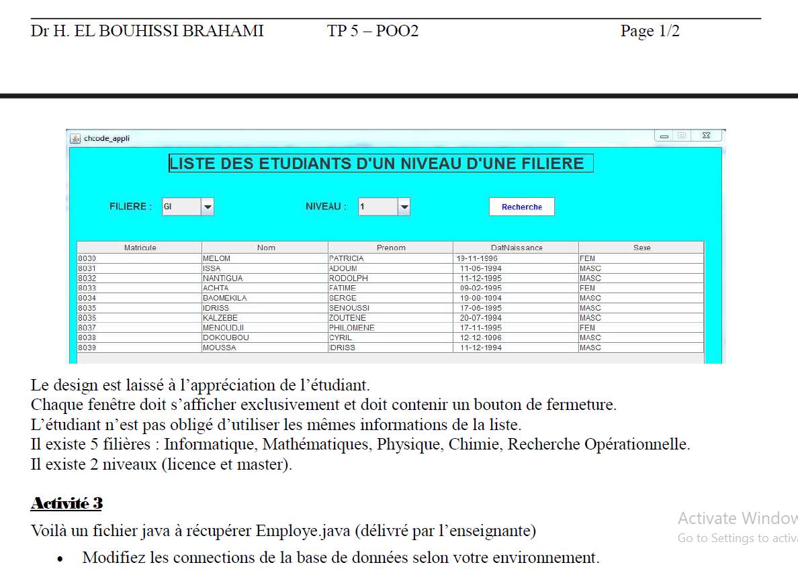
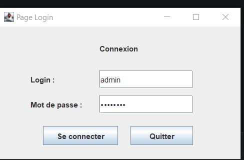
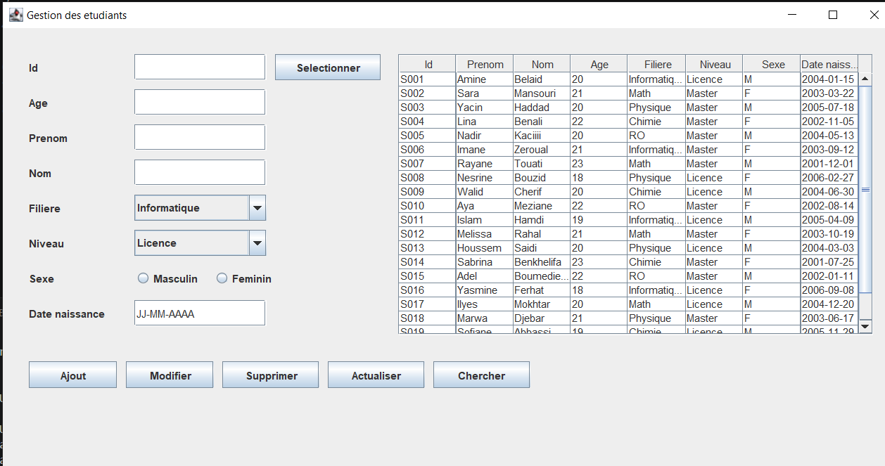
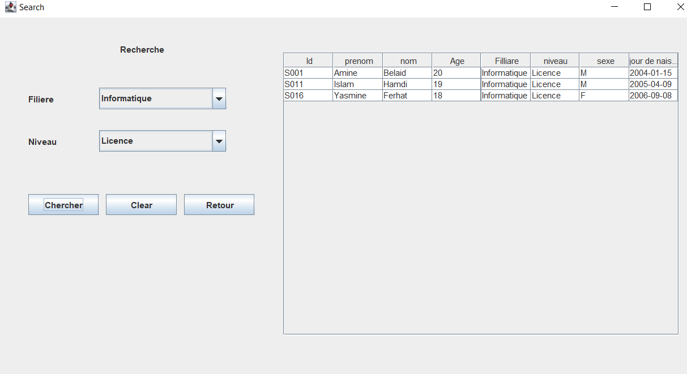

# TP 5 – OOP2: Activity 2 (School Management)

  
  

## Description  
This project consists of developing a Java school management application with a graphical user interface. The application allows managing students (add, edit, delete, search) and displaying filtered lists based on department and level.

## Technologies used  
- Java (JDK)  
- Java Swing (graphical interface)  
- SQLite (LocalDB)  
- JDBC (database connection)

## Database  
I used **SQLite in local mode (LocalDB)** to store data.  
The database mainly contains two tables:  
- **authentication** (matricule, password)  
- **student** (matricule, name, surname, birthDate, gender, department, level)
- i used a **populate.java** file to create the tables/add dummy data each time it runs ( like that the software does save the changes , you can modify it a bit so that it give you the same data each time  )

## Features  
- User authentication  
- Main student management interface  
- Add a student  
- Edit student information  
- Delete a student  
- Search by matricule  
- Display students by department and level  

## Graphical interface  
SPECIAL THANKS FOR CODEX (THAT MAN SAVED ME A LOT OF TIME DOING THAT BORING STUFF) .
The application was built using **Java Swing**, providing:  
- Login window  
- Main management window  
- Search and filter window  
- Dynamic table for displaying students  

## Notes  
- The interface design is simple and left to the student's choice.  
- The application uses a local database (SQLite), so no external server is required.

## IMPORTANT (inclueded in cmd.txt) : 
to run , run this cmd in the root (not in src) :
(compile)
javac -cp "src/lib/sqlite-jdbc-3.8.9.1.jar" src\*.java
(execute)
java -cp "src;src/lib/sqlite-jdbc-3.8.9.1.jar" Main

Login credintials
USERNAME : "admin" 
PASSWORD : "admin123"

## LOGIN INTERFACE :

  

## STUDENT MANAGER : 
-YOU CAN SELECT BY ID AND THEN UPDATE/DELETE
-YOU CAN ADD NEW STUDENTS (USING A NEW ID)

  

## SEARCH :
- GROUP/SEARCH STUDENTS OF A SPECIALTY AND A LEVEL(LICENCE/MASTER) 

  

## Author  
Project developed as part of the OOP2 module – TP 5
